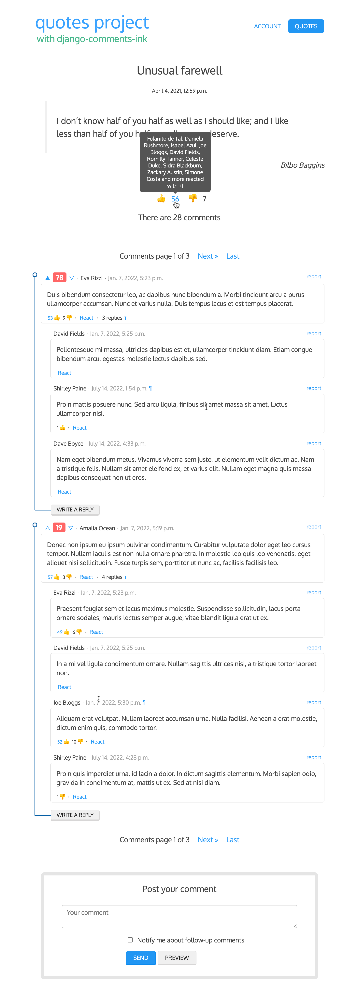

# dci-project-quotes

... is a very simple Django project with only three dependencies:
 * django>=4,<5
 * django-contrib-comments>=2.2,<2.3
 * django-debug-toolbar>=3.2,<3.3
 * django-comments-ink==0.0.1

Features:
 * It is a fully backend driven project (no JavaScript needed).
 * Users and visitors can send comments and replies.
 * The maximum thread level is one, which seems to be the most common scenario: users or visitors can send comments either using the main comment form or by clicking on the "write a reply" button (see the sample image below). Modify the the maximum thread level using either the setting `COMMENTS_INK_MAX_THREAD_LEVEL` or `COMMENTS_INK_MAX_THREAD_LEVEL_BY_APP_MODEL`.
 * Users can send reactions to each Quote. The available reactions are +1 and -1, which correspond to the default reactions provided with django-comments-ink ([here](https://github.com/comments-ink/django-comments-ink/blob/0abfbee5e02a8886f646d4bd39b3e4d89e699823/django_comments_ink/models.py#L392)), but they can be customized modifying the setting [`COMMENTS_INK_OBJECT_REACTIONS_ENUM`](https://github.com/comments-ink/django-comments-ink/blob/0abfbee5e02a8886f646d4bd39b3e4d89e699823/django_comments_ink/conf/defaults.py#L38).
 * Users can also send reactions to each comment. The available reactions for comments in this project are the same as the reactions for objects. Modify the setting [`COMMENTS_INK_COMMENT_REACTIONS_ENUM`](https://github.com/comments-ink/django-comments-ink/blob/0abfbee5e02a8886f646d4bd39b3e4d89e699823/django_comments_ink/conf/defaults.py#L35) to change the list of reactions available for comments.
 * django-comments-ink comes by default with a few themes that change the look of the comments. The one in the image below is the default theme, used when the setting `COMMENTS_INK_THEME_DIR` is empty. It can take the following values, that correspond with the directories under `templates/comments/themes` in django-comments-ink:
   * `avatar_in_header`
   * `avatar_in_thread`
   * `feedback_in_header`

## Setup virtual environment

Create a virtual environment:

    $ python3.10 -m venv venv
    $ source venv/bin/activate
    $ pip install -r requirements.txt

## Setup the Django project

Run Django's `migrate` command and load the fixture data:

    $ cd project_quotes
    $ python manage.py migrate
    $ python manage.py loaddata ../fixtures/sites.json
    $ python manage.py loaddata ../fixtures/users.json
    $ python manage.py loaddata ../fixtures/quotes.json
    $ python manage.py loaddata ../fixtures/comments.json

And finally launch the development server:

    $ python manage.py runserver

## About users

The project allows you to login using any of the users provided with the `users.json` fixture. There are 110 users. Here are the login email and password of the first 10. The rest follow the same pattern; they have as password the left side of the email address:

 * `admin@example.com`, password `admin`
 * `fulanito@example.com`, password `fulanito`
 * `mengo@example.com`, password `mengo`
 * `daniela.rushmore@example.com`, password `daniela.rushmore`
 * `lena.rosenthal@example.com`, password `lena.rosenthal`
 * `amalia.ocean@example.com`, password `amalia.ocean`
 * `isabel.azul@example.com`, password `isabel.azul`
 * `joe.bloggs@example.com`, password `joe.bloggs`
 * `eva.rizzi@example.com`, password `eva.rizzi`
 * `david.fields@example.com`, password `david.fields`
